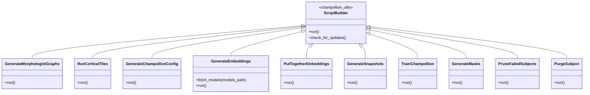
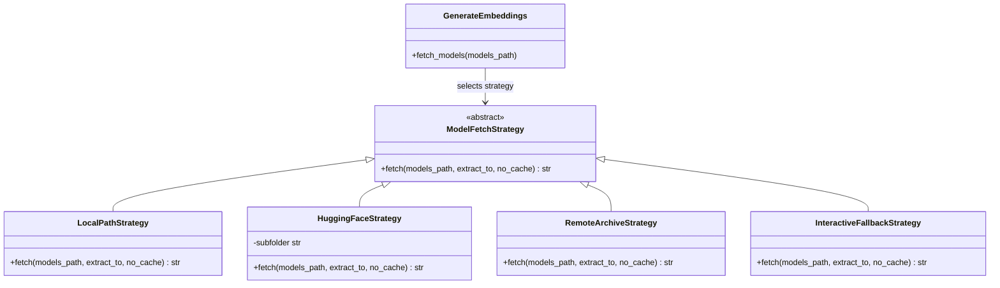
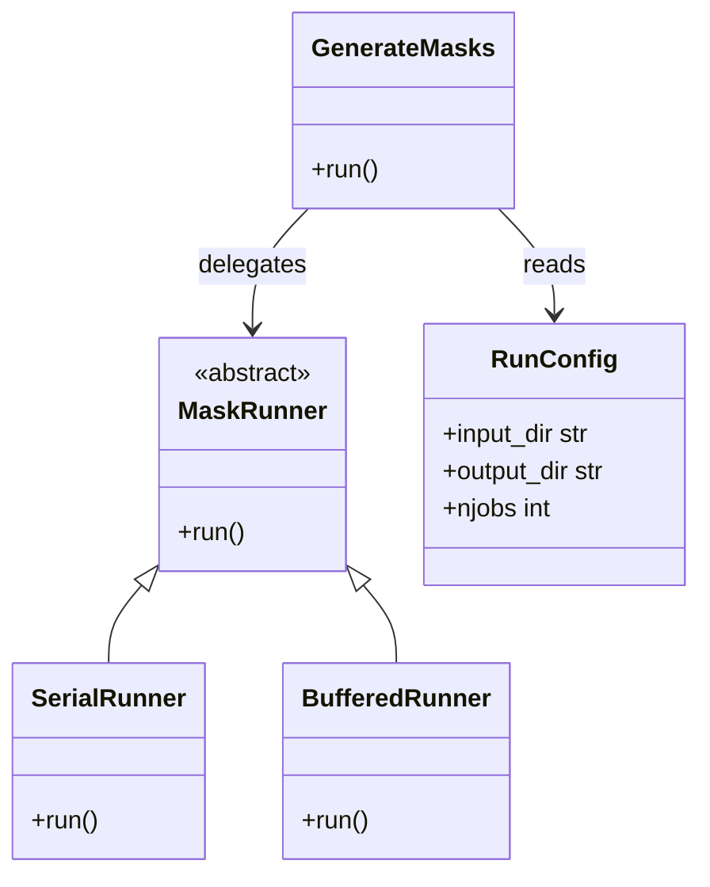
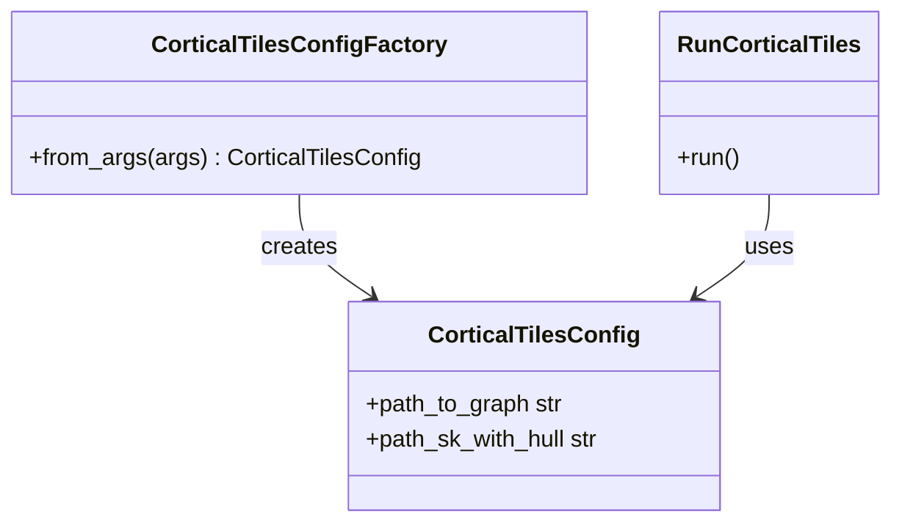
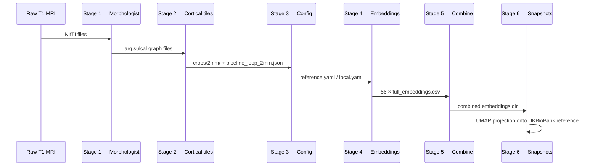

# Module Reference

This page documents the public Python interface of `champollion_pipeline`.
All pipeline scripts subclass `ScriptBuilder` (from `champollion_utils`),
which provides a fluent `argparse` builder API and automatic update checks on startup.

## Class diagrams

### ScriptBuilder hierarchy — pipeline scripts



### Model fetch strategy (stage 4 — embeddings)



### Mask runner hierarchy (generate_masks)



### Cortical tiles config (utils)



### Pipeline data flow



---

## Module autodoc

### generate_champollion_config

```{eval-rst}
.. automodule:: champollion_pipeline.generate_champollion_config
   :members:
   :undoc-members:
   :show-inheritance:
```

### generate_embeddings

```{eval-rst}
.. automodule:: champollion_pipeline.generate_embeddings
   :members:
   :undoc-members:
   :show-inheritance:
```

### generate_morphologist_graphs

```{eval-rst}
.. automodule:: champollion_pipeline.generate_morphologist_graphs
   :members:
   :undoc-members:
   :show-inheritance:
```

### generate_snapshots

```{eval-rst}
.. automodule:: champollion_pipeline.generate_snapshots
   :members:
   :undoc-members:
   :show-inheritance:
```

### prune_failed_subjects

```{eval-rst}
.. automodule:: champollion_pipeline.prune_failed_subjects
   :members:
   :undoc-members:
   :show-inheritance:
```

### purge_subject

```{eval-rst}
.. automodule:: champollion_pipeline.purge_subject
   :members:
   :undoc-members:
   :show-inheritance:
```

### put_together_embeddings

```{eval-rst}
.. automodule:: champollion_pipeline.put_together_embeddings
   :members:
   :undoc-members:
   :show-inheritance:
```

### run_cortical_tiles

```{eval-rst}
.. automodule:: champollion_pipeline.run_cortical_tiles
   :members:
   :undoc-members:
   :show-inheritance:
```

### train_champollion

```{eval-rst}
.. automodule:: champollion_pipeline.train_champollion
   :members:
   :undoc-members:
   :show-inheritance:
```
