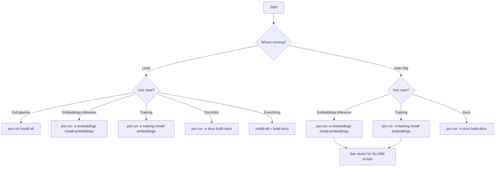

# Setup

This page maps your **location** (Local or Jean-Zay) and **use case** to the
correct `pixi` environment and install command.

> **Interactive wizard**: run `pixi run setup` (or `./install.sh`) for a
> guided prompt that selects the right command for you.

## Decision tree

> **Jean-Zay note**: always pass `-e <env>`. Never use the default environment.

## Summary table

| Use case | Environment | Install command |
|---|---|---|
| Full pipeline | `default` | `pixi run install-all` |
| Embeddings inference | `embeddings` | `pixi run -e embeddings install-embeddings` |
| Training | `training` | `pixi run -e training install-embeddings` |
| Docs / development | `docs` | `pixi run -e docs build-docs` |
